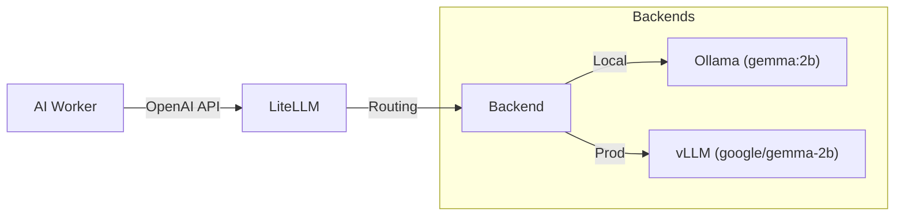

# AI Deployment Guide (vLLM & LiteLLM)

This project uses **LiteLLM** as a gateway to abstract underlying inference engines. We support two primary setups:
1. **Local Development**: Using **Ollama** (lightweight, easy to run on CPUs/Consumer GPUs).
2. **Production/High-Performance**: Using **vLLM** (high throughput, requires NVIDIA GPU).

## Architecture



## Configuration

The selection of the backend is controlled via Environment Variables in your `.env` file (or orchestrator).

### 1. Local Development (Default)
Use `ollama` profile to run the local inference engine.

```bash
# .env
AI_MODEL_TARGET=ollama/gemma:2b
AI_API_BASE=http://ollama:11434
```

Start with:
```bash
docker-compose --profile local up -d
```
*Note: The `ollama-init` service will automatically pull `gemma:2b`.*

### 2. Production with vLLM (Local Docker)
If you have a GPU machine and want to run vLLM via Docker Compose on the same host:

```bash
# .env
HUGGING_FACE_HUB_TOKEN=hf_... # Required for Gemma model access
AI_MODEL_TARGET=openai/google/gemma-2b
AI_API_BASE=http://vllm:8000/v1
```

Start with:
```bash
docker-compose --profile vllm up -d
```
*Note: This requires the NVIDIA Container Toolkit to be installed on the host.*

### 3. Production with Remote vLLM (Separate Server)
If vLLM is running on a dedicated GPU server (e.g., `http://192.168.1.50:8000`):

```bash
# .env
AI_MODEL_TARGET=openai/google/gemma-2b
AI_API_BASE=http://192.168.1.50:8000/v1
```

In this case, **do not** start the `vllm` service in your application's `docker-compose`.

## vLLM Standalone Setup (On Remote Server)
To run vLLM on a dedicated server:

```bash
docker run --runtime nvidia --gpus all \
    -v ~/.cache/huggingface:/root/.cache/huggingface \
    -p 8000:8000 \
    --env HUGGING_FACE_HUB_TOKEN=hf_... \
    --ipc=host \
    vllm/vllm-openai:latest \
    --model google/gemma-2b --dtype half --max-model-len 1024
```
